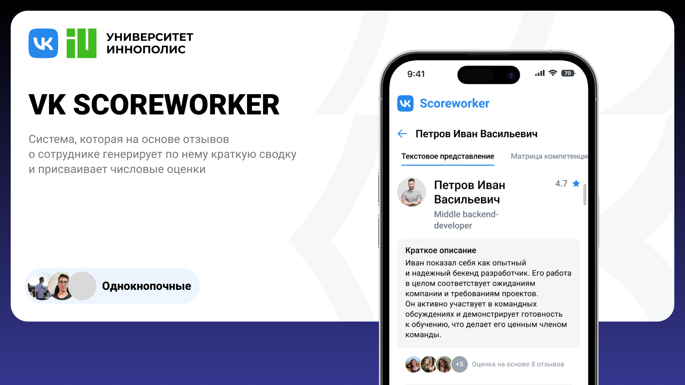

# ScoreWorker

ScoreWorker — система метрик сотрудников на основе обратной связи от коллег и руководителей, разработанная для
автоматизации и улучшения процессов HR-аналитики.



## Основные возможности

1. **Автоматизация анализа**: Значительная экономия времени на обработку данных с помощью автоматизации.
2. **Объективность оценок**: Анализ основан на данных от различных источников.
3. **Гибкость**: Возможность настройки критериев под специфические нужды.
4. **Визуализация**: Наглядное представление критериев оценки для удобства понимания.
5. **Интеграция**: Решение легко встраивается в корпоративные системы.

## Архитектура системы

- **Микросервисная архитектура**
- **Технологии CI/CD**: Docker, Render
- **Фронтенд**: Vue.js
- **Бекенд**: Django
- **Интеграция**: LDAP и OAuth через Authelia
- **Модель Машинного Обучения**: LLaMA-3.1-70B-Instruct

## Алгоритмы оценки

1. Сбор и анализ отзывов
2. Применение промптов для оценки содержания
3. Генерация сводки отзывов
4. Расчёт итоговой оценки

## Пример работы
[Live](https://innoprom-hack-1.onrender.com/)


## Установка и запуск

1. Клонируйте репозиторий:
   ```bash
   git clone https://github.com/Mishutka04/innoprom_hack
   cd innoprom_hack
   ```

2. Запустите приложение:
   ```bash
   docker-compose up --build
   ```

3. Фронтенд: http://localhost:5173
4. Бэкенд: http://localhost:8080

## Дальнейшее развитие

1. Визуализация динамики изменений оценки
2. Групповая оценка
3. Автоматизация отчетов и новые фильтры
4. Улучшение масштабируемости и интеграция с другими системами
